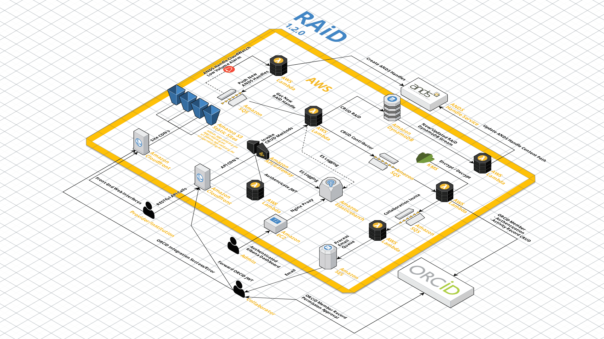

# RAiD API

The [Data LifeCycle Framework](www.dlc.edu.au) (DLC) has been initiated by five primary organisations; [Australian Access Federation](https://aaf.edu.au/) (AAF), [Australia’s Academic and Research Network](https://www.aarnet.edu.au/) (AARNet), [Australian National Data Service](http://www.ands.org.au/) (ANDS), [National eResearch Collaboration Tools and Resources](https://nectar.org.au/) (NeCTAR) and [Research Data Services](http://www.rds.edu.au/) (RDS).

The DLCF is a nationwide effort to connect research resources and activities such that researchers can make the best use of existing national, state-based, local, and commercial eResearch tools. It aims to provide a simple path to reliable provenance, more effective collaboration across organisations and assist researchers to position themselves to address the growing potential of increasingly open data.

The DLCF will connect critical elements and points in time of the data journey from grant approval through to project finalisation, results publication and archiving. It will leverage existing eResearch investment to provide a flexible and dynamic national framework supporting research.

The Resource and Activity Persistent identifier (RAiD) is the first of the enabling technologies required for the DLCF.*RAiD API* is a '**proof of concept**' [Serverless](https://aws.amazon.com/serverless/) implementation designed to be hosted on Amazon Web Services (AWS) that will help create and manage RAiDs.

## Current version: 1.2.0

## Serverless Components
AWS serverless applications are able to conform to a [multi-tier architecture]( https://d0.awsstatic.com/whitepapers/AWS_Serverless_Multi-Tier_Architectures.pdf), consisting of three defined tiers:
* Data - Store all research activity information and generated JWT tokens for research organisations and providers in AWS DynamoDB (NOSQL). AFF authenticated users JWT tokens are not stored as they are provided by RAPID AAF.
* Logic - RESTful api call are mapped to end points mapped in Amazon API Gateway. API Gateway processes HTTP requests by using micro-services (AWS Lambda using Python runtime) behind a custom security policy (JWT token validation). HTTP status codes and responses are generated depending on the result of the AWS Lambda function.
* Presentation - Static assets (HTML, JavaScript, CSS, etc.) are stored in AWS S3 buckets with public HTTP GET access. AWS provides a HTTP endpoint for content hosting, but disallows server side generated content. This is overcome by storing authenticated sessions as cookies and producing dynamic content with RESTful calls to API Gateway with CORS enabled.

*RAiD API* is made and deployed using [AWS Serverless Application Model (AWS SAM)](https://github.com/awslabs/serverless-application-model) extension of CloudFormation.


> "The AWS Serverless Application Model (AWS SAM, previously known as Project Flourish) extends AWS CloudFormation to provide a simplified way of defining the Amazon API Gateway APIs, AWS Lambda functions, and Amazon DynamoDB tables needed by your serverless application". [(AWS 2016)](https://aws.amazon.com/about-aws/whats-new/2016/11/introducing-the-aws-serverless-application-model/)

## AWS Architecture




## Getting Started
Development and deployment of the framework will require the following:

### Third-Party Integrations

##### ANDS

*RAiD* uses the [*ANDS Handle Service*](https://www.ands.org.au/online-services/handle-service) to generate unique and
citable 'handles'. This allows organisations and researchers to have a 'clickable' link in their datasets, collections
and papers. Handles act as the primary key for a RAiD and are associated to a URL content path which can be changed,
but the handle will remain the same. The following steps a required for *RAiD API* to interact with the minting service:
  1. [Register with ANDS](https://documentation.ands.org.au/pages/viewpage.action?pageId=59409375).
  2. Use the 'appID' for the 'AndsAppId' parameter in the deployment steps mentioned later in this document.
  
##### ORCID

*RAiD* uses the [*ORCID*](https://orcid.org/) to authenticate contributors and create, update and delete records on
their behalf:
  1. Register with the [Sandbox ORCID environment](https://orcid.org/content/register-client-application-sandbox).
  2. Register with the [Production ORCID environment](https://orcid.org/content/register-client-application-production-trusted-party)
  once approved by the ORCID team.


### AWS Environment Prerequisites

* AWS S3 Bucket for SAM code packages.
* Amazon Elasticsearch Service endpoint for logging and monitoring.

### System Deployment Prerequisites
* [Python](https://www.python.org/download/releases/2.7/):  AWS Lambda supported Python language runtime 2.7.
* [PIP](https://pip.pypa.io/en/stable/) : Install and manage Python Modules
* [AWS Command Line Interface](https://aws.amazon.com/cli/): Unified tool to manage your AWS services.
* [Boto3](https://boto3.readthedocs.io/en/latest/) : Amazon Web Services SDK for Python.
* [Ansible](https://www.ansible.com/): Ansible to use as orchestration tool to deploy and fetch secure values 

### Installing System Deployment Prerequisites

```bash
# Install PIP
python get-pip.py

# Install AWS CLI
pip install awscli

# Configure AWS CLI
aws configure
AWS Access Key ID [None]: <Access Key>
AWS Secret Access Key [None]: <Secret>
Default region name [None]: <Region>
Default output format [None]: ENTER

# Install Boto3 and Ansible
pip install boto3==1.12.5
pip install ansible==2.9.5
```

## Deployment

### Ansible

Ansible will deploy the AWS resources and use CloudFormation parameters based on what is in the "var" file provided. By default it will use an environment of "dev" and look for a file called ```vars/dev.yml```. There is an example file called ```vars/example.yml``` that will show you what you need to set in your own development var file.

In addition there is a provided ```vars/prd.yml``` which informs Ansible to look up values safely stored in the [AWS Systems Manager Parameter Store](https://docs.aws.amazon.com/systems-manager/latest/userguide/systems-manager-parameter-store.html). **For this reason, there are no secret values stored in the "prd" file and it is fine to be uploaded.**

```bash
# Set Fork settings if using OSX to avoid async errors
export OBJC_DISABLE_INITIALIZE_FORK_SAFETY=YES

# Deploy RAiD using Ansible (default to development)
ansible-playbook site.yml -vvv

# Deploy RAiD using Ansible and point to production vars file (use vars/prd.yml)
ansible-playbook site.yml -vvv --extra-vars "env=prd"
```

## License

MIT-Style akin to ORCiD. See LICENCE.txt for details.
