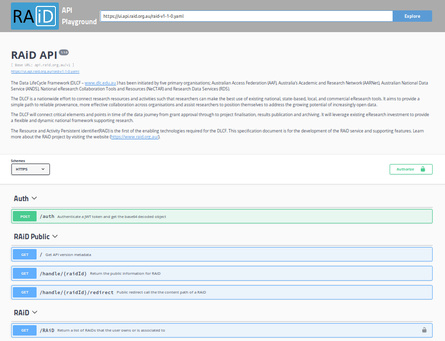
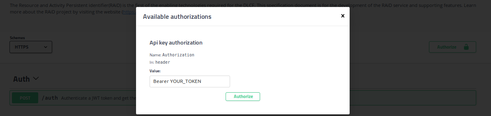
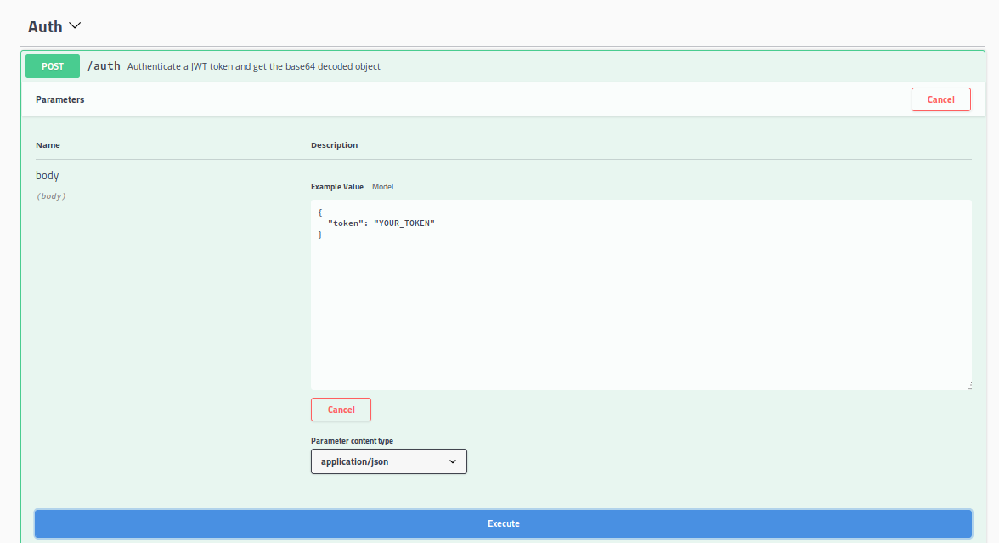
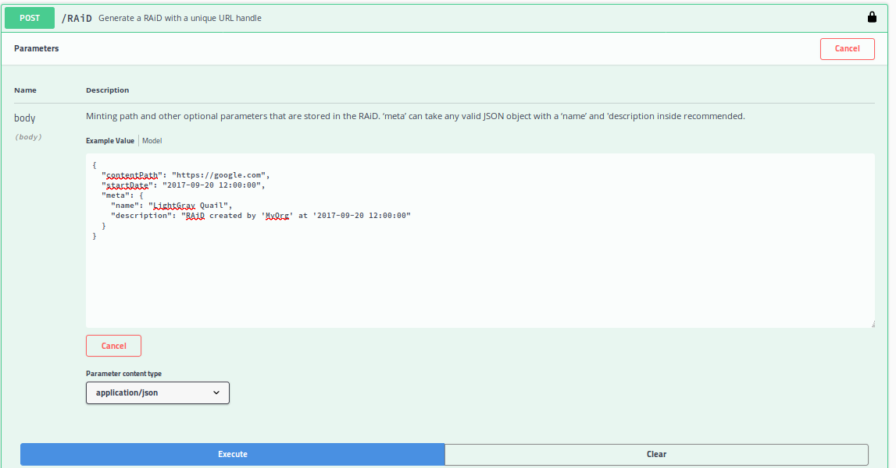
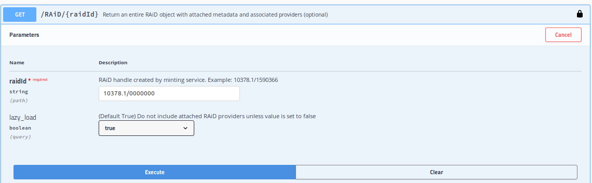
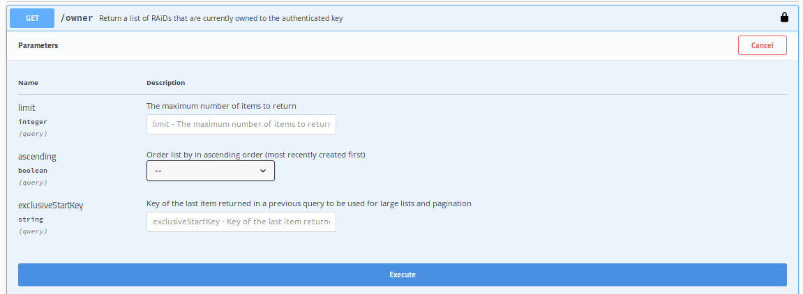
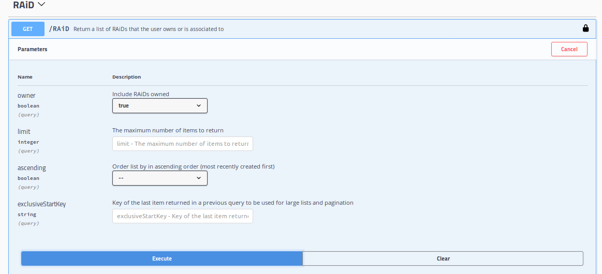
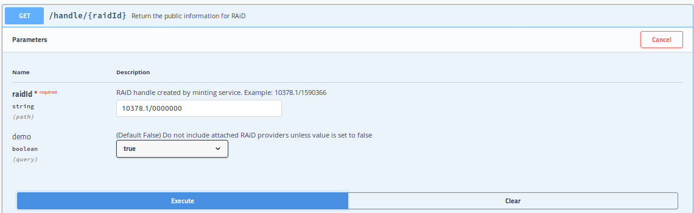

# RAiD API Examples
- [Getting Started](#getting-started)
- [Validating an API Token](#validating-an-api-token)
- [Creating a RAiD](#creating-a-raid)
- [Viewing a RAiD](#viewing-a-raid)
- [Listing RAiDs you own](#listing-raids-you-own)
- [Listing RAiDs you are associated to](#listing-all-raids-you-are-associated-to)
- [Viewing a RAiD (Public)](#viewing-a-raid-public)
- [Redirecting to a RAiDs content path (Public)](#redirecting-to-a-raids-content-path-public)

### Getting Started
###### API Playground
The RAiD API Playground is a fork of the [*Swagger UI*](https://swagger.io/swagger-ui/) framework, which renders the RAiD *swagger* API document into a GUI for human friendly RESTful calls. It can be found at the URL ['ui.api.raid.org.au'](https://ui.api.raid.org.au).


###### Authentication Headers
RAiD API has both public and authenticated endpoints to interact with. Authenticated endpoints all require an *'Authorization'* header that is made up of your assigned API key (JWT) in the format:```Authorization: Bearer YOUR_TOKEN```. Visit ['jwt.io'](https://jwt.io/) to check if the API key you have copied is in the valid JWT format. If you are using the API Playground, the authorization header is added by clicking the 'Authorize' padlock symbol .
```bash
curl ... -H  "Authorization: Bearer YOUR_TOKEN" ...
```



###### RAiD handles in URL paths
RAiD IDs are made using the [ANDS handle service](https://www.ands.org.au/online-services/handle-service) and contain a forward slash '/' character as part of the handle format. However, at this current point in time any URL path parameter that requires a RAiD ID will need to be URL encoded.
```
# RAiD 10378.1/0000000

## Handle Prefix
10378.1
## Handle Suffix
0000000

## Good URL
https://api.raid.org.au/v1/handle/10378.1%2F0000000?demo=true
## Bad URL
https://api.raid.org.au/v1/handle/10378.1/0000000?demo=true
```

### Validating an API Token
A RAiD API key can be validated using the public *'auth'* path. However, this does not generate a temporary token to use. Instead it only validates a key and returns it's payload.
###### POST https://api.raid.org.au/v1/auth
```bash
curl -X POST "https://api.raid.org.au/v1/auth" -H  "accept: application/json" -H  "Content-Type: application/json" -d "{  \"token\": \"YOUR_TOKEN\"}"
```

###### Return 200
```json
{
  "sub": "MyOrg",
  "iss": "https://www.raid.org.au",
  "environment": "demo",
  "role": "service",
  "exp": 1570924800,
  "iat": 1507866567,
  "aud": "https://api.raid.org.au"
}
```

### Creating a RAiD
RAiDs can be created by any service provider with a defined or empty *JSON* body. Default values are used for any missing field. The '*meta*' field is an object, but at minimum will contain a '*name*' and '*description*' after creation.
* **contentPath**: 'https://www.raid.org.au/'
* **startDate**: Current date and time 'yyyy-MM-dd hh:mm:ss'
* **meta['name']**: 'colour animal_name'
* **meta['description']**: ''RAiD created by 'MyOrg' at 'yyyy-MM-dd hh:mm:ss'


```json
# Create RAiD JSON body
## An empty RAiD with default Values
{}
## A RAiD with a content path and default Values
{
  "contentPath": "https://google.com"
}
## A RAiD with no default values
{
  "contentPath": "https://google.com",
  "startDate": "2017-09-20 12:00:00",
  "meta": {
    "name": "LightGray Quail",
    "description": "RAiD created by 'MyOrg' at '2017-09-20 12:00:00"
  }
}
```
###### POST https://api.raid.org.au/v1/RAiD
```bash
curl -X POST "https://api.raid.org.au/v1/RAiD" -H  "accept: application/json" -H  "Authorization: Bearer YOUR_TOKEN" -H  "Content-Type: application/json" -d "{  \"contentPath\": \"https://google.com\",  \"startDate\": \"2017-09-20 12:00:01\",  \"meta\": {    \"name\": \"LightGray Quail\",    \"description\": \"RAiD created by 'MyOrg' at '2017-09-20 12:00:01\"  }}"
```

###### Return 200
```json
{
  "startDate": "2017-09-20 12:00:00",
  "handle": "10378.1/0000000",
  "providers": [
    {
      "startDate": "2017-09-20 12:00:00",
      "provider": "MyOrg"
    }
  ],
  "contentPath": "https://www.raid.org.au/",
  "meta": {
    "name": "LightGray Quail",
    "description": "RAiD created by 'MyOrg' at '2017-09-20 12:00:00'"
  },
  "contentIndex": "1",
  "owner": "MyOrg",
  "creationDate": "2017-09-20 12:00:00"
}
```
### Viewing a RAiD
Viewing the contents of a RAiD in full detail is limited to authenticated calls only. The Boolean query string parameter '*lazy_load*' determines whether all service provider and institution associations should be returned as part of the result. Alternatively you could find these associations in separate API calls.
* **lazy_load** (query)
  * false: RAiD DMR and attached 'providers' and 'institutions'
  * true: RAiD DMR only
* **raidId** (path)
  * API Playground: '10378.1/0000000'
  * Curl encoded handle: '10378.1%2F0000000'

###### GET https://api.raid.org.au/v1/RAiD/{HANDLE_PREFIX}%2F{HANDLE_SUFFIX}?lazy_load=false
```bash
curl -X GET "https://api.raid.org.au/v1/RAiD/10378.1%2F0000000?lazy_load=true" -H  "accept: application/json" -H  "Authorization: Bearer YOUR_TOKEN"
```


###### Return 200
```json
{
  "startDate": "2017-09-20 12:00:00",
  "handle": "10378.1/0000000",
  "providers": [
    {
      "startDate": "2017-09-20 12:00:00",
      "provider": "MyOrg"
    }
  ],
  "contentPath": "https://www.raid.org.au/",
  "meta": {
    "name": "LightGray Quail",
    "description": "RAiD created by 'MyOrg' at '2017-09-20 12:00:00'"
  },
  "contentIndex": "1",
  "owner": "MyOrg",
  "creationDate": "2017-09-20 12:00:00"
}
```

### Listing RAiDs you own
A simplified list of RAiDs you currently own:
* **startDate**: Start date (yyyy-MM-dd hh:mm:ss')
* **endDate (optional)**: End date (yyyy-MM-dd hh:mm:ss')
* **raidName**: Value of the current RAiD meta data field 'name'
* **handle**: ANDS Handle generated RAiD ID

###### GET https://api.raid.org.au/v1/owner
```bash
curl -X GET "https://api.raid.org.au/v1/owner" -H  "accept: application/json" -H  "Authorization: Bearer YOUR_TOKEN"
```


###### Return 200
```json
{
  "count": 3,
  "items": [
    {
      "startDate": "2017-09-20 12:00:00",
      "endDate": "2017-09-20 09:30:00",
      "handle": "10378.1/0000000",
      "raidName": "LightGray Quail"
    },
    {
      "startDate": "2017-09-20 12:00:01",
      "handle": "10378.1/0000001",
      "raidName": "LightGray Chicken"
    },
    {
      "startDate": "2018-01-23 23:44:01",
      "handle": "10378.1/0000002",
      "raidName": "DimGray Loris"
    }
  ]
}
```

### Listing all RAiDs you are associated to
A simplified list of RAiDs you are currently associated with:
* **startDate**: Start date (yyyy-MM-dd hh:mm:ss')
* **endDate (optional)**: End date (yyyy-MM-dd hh:mm:ss')
* **role (optional)**: A privileged role, example 'owner'
* **raidName**: Value of the current RAiD meta data field 'name'
* **handle**: ANDS Handle generated RAiD ID

The Boolean query string parameter '*owner*' determines whether RAiDs you own should also be contained in the list.
* **owner** (query)
  * false: Include RAiDs you have been attached to
  * true: Include RAiDs you own

###### GET https://api.raid.org.au/v1/RAiD?owner=true
```bash
curl -X GET "https://api.raid.org.au/v1/RAiD?owner=true" -H  "accept: application/json" -H  "Authorization: Bearer YOUR_TOKEN"
```


###### Return 200
```json
{
  "count": 4,
  "items": [
    {
      "handle": "10378.1/0000000",
      "startDate": "2017-09-20 12:00:00",
      "endDate": "2017-09-20 09:30:00",
      "role": "owner",
      "raidName": "LightGray Quail"
    },
    {
      "handle": "10378.1/0000001",
      "startDate": "2017-09-20 12:00:01",
      "role": "owner",
      "raidName": "LightGray Chicken"
    },
    {
      "handle": "10378.1/0000002",
      "startDate": "2018-01-23 23:44:01",
      "role": "owner",
      "raidName": "DimGray Loris"
    },
    {
      "handle": "10378.1/0000003",
      "startDate": "2018-02-08 12:00:21",
      "raidName": "Tan Panther"
    }
  ]
}
```

### Viewing a RAiD (Public)
RAiDs have a public view that can be used for validation. As there is a 'Demo' and 'Live' environment of the RAiD API, the optional Boolean query string parameter '*demo*' determines the environment.
* **demo** (query)
  * false (default): RAiDs created using a production API key for real projects.
  * true: Testing RAiDs that were created using a demo API key.
* **raidId** (path)
  * API Playground: '10378.1/0000000'
  * Curl encoded handle: '10378.1%2F0000000'

###### GET https://api.raid.org.au/v1/handle/{HANDLE_PREFIX}%2F{HANDLE_SUFFIX}?demo=true
```bash
curl -X GET "https://api.raid.org.au/v1/handle/10378.1%2F0000000?demo=true" -H  "accept: application/json"
```


###### Return 200
```json
{
  "contentPath": "https://www.raid.org.au/",
  "creationDate": "2017-09-20 12:00:00",
  "handle": "10378.1/0000000"
}
```

### Redirecting to a RAiDs content path (Public)
RAiDs have a public view that can be used for validation. As there is a 'Demo' and 'Live' environment of the RAiD API,
The optional Boolean query string parameter '*demo*' determines the environment. Redirects can be helpful for RAiDs that don't have permanent content paths as users will always be redirected to the most recent version.
* **demo** (query)
  * false (default): RAiDs created using a production API key for real projects.
  * true: Testing RAiDs that were created using a demo API key.
* **raidId** (path)
  * Curl encoded handle: '10378.1%2F0000000'


  ###### GET https://api.raid.org.au/v1/handle/{HANDLE_PREFIX}%2F{HANDLE_SUFFIX}/redirect?demo=true
  ```bash
  curl -X GET "https://api.raid.org.au/v1/handle/10378.1%2F1592680/redirect?demo=true" -H  "accept: application/json"
  ```

  ###### Return 307
  ```
  Headers
    location: https://www.raid.org.au/
  ```
